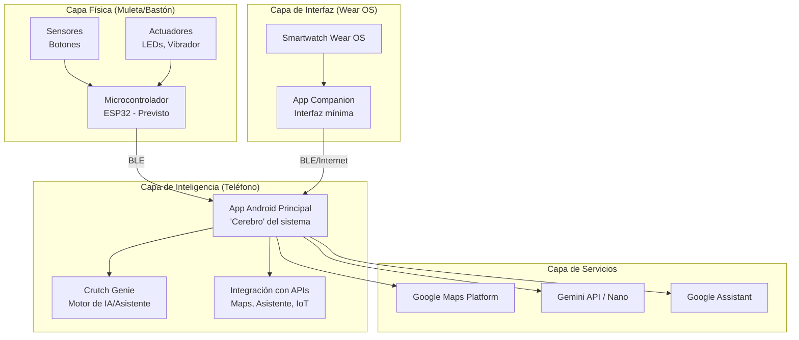

# 🦯 SmartWand / Crutch Genie

[Demo](https://github.com/Charran78/SmartWand/blob/main/genie_banner.png)

[](https://github.com/Charran78/smartwand) [](LICENSE) [](https://github.com/Charran78/smartwand)

**SmartWand** (también llamado **Crutch Genie**) es una plataforma de código abierto que transforma una muleta o bastón en un asistente inteligente y conectado. Nace de la necesidad personal de aumentar la autonomía y seguridad, combinando hardware reciclado con software que aprovecha al máximo la inteligencia y servicios gratuitos de un teléfono Android.

> **Filosofía**: "Si funciona, no es obsoleto. El código y las soluciones a cosas cotidianas están en todas partes, solo hay que saber mirar."

---

## ✨ Características

| Módulo | Estado | Descripción |
| :--- | :--- | :--- |
| **🛠️ Hardware Básico (McGyver Crutches)** | ✅ **Implementado** | Linterna LED, baliza trasera, pinza porta-bolsas, llave magnética, bocina, energía con batería 18650 reciclada. |
| **⌚ Interfaz Smartwatch Genérico** | ✅ **Implementado** | Control de música, notificaciones, llamadas y más mediante un smartwatch económico revivido. |
| **🧠 Núcleo de App Android (Cerebro)** | 🚧 **En Desarrollo** | App que centraliza la lógica, conecta todos los componentes y gestiona las APIs. |
| **🤖 Asistente "Crutch Genie" (IA)** | 📅 **Planificado** | Asistente especializado usando Gemini API (gratuita) para navegación contextual y respuestas inteligentes. |
| **📟 App Companion Wear OS** | 📅 **Planificado** | App para relojes Wear OS para control por gestos e interfaz mínima. |
| **📡 Comunicación BLE con ESP32** | 📅 **Planificado** | Reemplazo de conexiones cableadas por un módulo ESP32 en la muleta para una comunicación robusta y programable. |

---

## 🏗️ Arquitectura del Sistema

El sistema está diseñado en capas independientes para facilitar el mantenimiento y la evolución a largo plazo.



---

## 🚀 Primeros Pasos (Para Desarrolladores)

### Prerrequisitos de Hardware
*   **Prototipo de Muleta**: Con componentes básicos soldados y alimentación (batería 18650 con protección TP4056).
*   **Smartphone Android**: Con soporte para BLE y Android 8.0+ (recomendado 10+).
*   **Smartwatch con Wear OS** *(Para desarrollo futuro)*: Cualquier modelo con Wear OS 3+ (ej: Fossil Gen 5, Samsung Galaxy Watch4+, Xiaomi Watch 2).
*   **ESP32 DevKit** *(Para desarrollo futuro)*: Para la versión avanzada de comunicación con la muleta.

### Prerrequisitos de Software
*   **Android Studio** (versión Flamingo o superior) con el SDK de Wear OS instalado.
*   **Git** para control de versiones.
*   Una cuenta de Google con acceso a:
    *   **Google Cloud Platform** (para habilitar APIs como Maps y Gemini - nivel gratuito).
    *   **Google Assistant SDK** (para integración con dispositivos IoT).

---

## ⚙️ Instalación y Configuración

### 1. Clonar el Repositorio
```bash
git clone https://github.com/Charan78/smartwand.git
cd smartwand
```

### 2. Configurar el Proyecto en Android Studio
*   Abre la carpeta `smartwand-app` (para la app del teléfono) y `smartwand-wear` (para la app del reloj) como proyectos independientes en Android Studio.
*   Sincroniza los proyectos con los archivos Gradle.

### 3. Configurar las APIs y Claves
1.  En Google Cloud Console, crea un nuevo proyecto o selecciona uno existente.
2.  Habilita las APIs necesarias:
    *   **Maps SDK for Android**
    *   **Gemini API**
3.  Genera una credencial de tipo **"Clave de API"**.
4.  Crea un archivo `secrets.properties` en la raíz del módulo de la app del teléfono (`smartwand-app`) con el siguiente contenido:
```properties
GOOGLE_MAPS_API_KEY="TU_CLAVE_DE_API_AQUÍ"
# Las claves para otras APIs se añadirán aquí en el futuro
```
5.  En el archivo `build.gradle` a nivel de módulo (`smartwand-app/build.gradle`), asegúrate de cargar estas propiedades y de **NO subir `secrets.properties` a control de versiones**. Añádelo a tu `.gitignore`.

### 4. Ejecutar en Dispositivos
*   **App del Teléfono**: Conecta tu smartphone Android con la depuración USB activada y ejecuta la configuración `app`.
*   **App del Reloj (Futuro)**: Conecta tu smartwatch Wear OS vía Bluetooth/ADB o usa un emulador, y ejecuta la configuración `wear`.

---

## 🤝 Cómo Contribuir

¡Las contribuciones, ideas y forks son bienvenidos! Este es un proyecto personal con una visión comunitaria.

1.  **Discute el cambio que deseas hacer**: Abre un **Issue** antes de trabajar en una funcionalidad grande para alinearnos.
2.  **Haz un Fork del proyecto** y crea una rama para tu funcionalidad (`git checkout -b feature/nueva-funcionalidad`).
3.  **Realiza tus cambios**, siguiendo la guía de estilo de código existente.
4.  **Realiza commits descriptivos** (te recomendamos usar [Conventional Commits](https://www.conventionalcommits.org/)).
5.  **Envía un Pull Request** (PR) detallando los cambios y el problema que resuelven.

### Convención de Commits
Usamos Conventional Commits para un historial claro:
*   `feat:` Nueva funcionalidad.
*   `fix:` Corrección de errores.
*   `docs:` Cambios en la documentación (como este README).
*   `refactor:` Cambios en el código que no corrigen errores ni añaden funcionalidades.
*   `test:` Añadir o corregir tests.

---

## 🧭 Hoja de Ruta (Roadmap)

- [ ] **Fase 0: Estabilización del Prototipo Físico** - Mejorar la robustez y seguridad del hardware actual (fusibles, driver para LEDs).
- [ ] **Fase 1: Núcleo de la App Android** - Desarrollar la app "cerebro" con conexión BLE básica e integración con Google Maps para estimación de rutas.
- [ ] **Fase 2: Adquisición y Desarrollo para Wear OS** - Conseguir un smartwatch con Wear OS y desarrollar la app companion mínima.
- [ ] **Fase 3: Integración del "Crutch Genie"** - Diseñar los prompts de sistema e integrar la API de Gemini para crear el asistente contextual.
- [ ] **Fase 4: Hardware Avanzado** - Integrar el ESP32 en la muleta para una comunicación BLE profesional y añadir sensores (IMU para gestos).
- [ ] **Fase 5: Comunidad y Documentación** - Publicar guías completas de "Hazlo-tú-mismo" (DIY), planos y fomentar un ecosistema de modificaciones.

**¿Te interesa ayudar en alguna fase en concreto?** ¡Mencionalo en los Issues!

---

## 📄 Licencia

Este proyecto está distribuido bajo la Licencia MIT. Consulta el archivo [LICENSE](LICENSE) para más información.

---

## 👨‍💻 Autor y Contacto

**Pedro** – Ingeniero de software, maker y solucionador de problemas cotidianos.

*   **GitHub**: [@Charran78](https://github.com/Charran78)
*   **Proyecto Inspirado en**: La necesidad real de mejorar la autonomía y la filosofía de reutilizar y dar nueva vida a la tecnología.

---
*¿Preguntas, ideas o quieres compartir tu propia adaptación? ¡Abre un Issue o una Discusión en el repositorio!*
