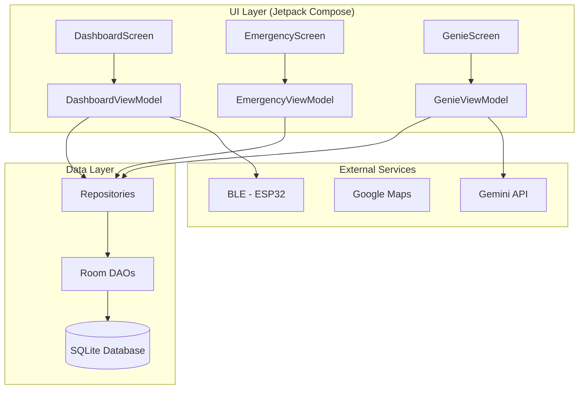

# <h1>🦯 SmartWand</h1>

<div align="center">
  
</div>

[](https://github.com/Charran78/SmartWand)
[](LICENSE)
[](https://github.com/Charran78/SmartWand)
[-3DDC84?logo=android)](https://developer.android.com)
[](https://kotlinlang.org)
[](https://developer.android.com/jetpack/compose)

**SmartWand** (también llamado **Crutch Genie**) es una plataforma de código abierto que transforma una muleta o bastón en un asistente inteligente y conectado. Nace de la necesidad personal de aumentar la autonomía y seguridad, combinando hardware reciclado con software que aprovecha al máximo la inteligencia y servicios gratuitos de un teléfono Android.

> **Filosofía**: "Si funciona, no es obsoleto. El código y las soluciones a cosas cotidianas están en todas partes, solo hay que saber mirar."

---

## ✨ Características

| Módulo | Estado | Descripción |
| :--- | :--- | :--- |
| **🛠️ Hardware Básico (McGyver Crutches)** | ✅ **Implementado** | Linterna LED, baliza trasera, pinza porta-bolsas, llave magnética, bocina, energía con batería 18650 reciclada. |
| **⌚ Interfaz Smartwatch Genérico** | ✅ **Implementado** | Control de música, notificaciones, llamadas y más mediante un smartwatch económico revivido. |
| **🧠 Núcleo de App Android (Cerebro)** | 🚧 **En Desarrollo** | App en Kotlin + Jetpack Compose con arquitectura MVVM, Room database, y navegación Material 3. |
| **🤖 Asistente "Crutch Genie" (IA)** | 🚧 **En Desarrollo** | Integración con Gemini API preparada, system prompt especializado para contexto de accesibilidad. |
| **📟 App Companion Wear OS** | 📅 **Planificado** | App para relojes Wear OS para control por gestos e interfaz mínima. |
| **📡 Comunicación BLE con ESP32** | 📅 **Planificado** | Módulo ESP32 en la muleta para comunicación robusta y programable. |

---

## 🏗️ Arquitectura del Sistema

El sistema está diseñado en capas independientes siguiendo **Clean Architecture** y patrón **MVVM**:



### Stack Tecnológico

| Componente | Tecnología |
|------------|------------|
| **Lenguaje** | Kotlin 2.0 |
| **UI** | Jetpack Compose + Material 3 |
| **Arquitectura** | MVVM + Clean Architecture |
| **DI** | Hilt |
| **Database** | Room |
| **Async** | Coroutines + Flow |
| **AI** | Gemini API (gemini-1.5-flash) |
| **Min SDK** | API 34 (Android 14) |

---

## 📱 Pantallas de la App

| Pantalla | Descripción |
|----------|-------------|
| **Dashboard** | Hub principal con estado de conexión, acciones rápidas (linterna, bocina, música), y botón de emergencia siempre visible |
| **Emergency** | Gestión de contactos de emergencia, botón de pánico, historial de caídas |
| **Devices** | Control de dispositivos IoT (luces, interruptores) |
| **Genie** | Chat con asistente IA Crutch Genie para rutas accesibles e información contextual |
| **Settings** | Configuración de idioma, tema, accesibilidad, y API keys |

---

## 🚀 Primeros Pasos

### Prerrequisitos

* **Android Studio** Flamingo o superior
* **JDK 17**
* **Dispositivo/Emulador** con Android 14+ (API 34)
* **Git** para control de versiones

### Instalación

```bash
# 1. Clonar el repositorio
git clone https://github.com/Charran78/SmartWand.git
cd SmartWand

# 2. Abrir en Android Studio
# File → Open → seleccionar carpeta "smartwand-app"

# 3. Sincronizar Gradle y ejecutar
# Run → Run 'app'
```

### Configurar Gemini API (Opcional)

1. Obtén una API key en [Google AI Studio](https://aistudio.google.com/apikey)
2. En la app: Settings → API → Introduce tu clave
3. ¡El Crutch Genie estará listo para ayudarte!

---

## 📂 Estructura del Proyecto

```
smartwand-app/
├── app/src/main/
│   ├── java/com/smartwand/
│   │   ├── MainActivity.kt           # Single Activity
│   │   ├── SmartWandApp.kt            # Hilt Application
│   │   ├── data/
│   │   │   ├── local/                 # Room Database + DAOs
│   │   │   ├── model/                 # Entities
│   │   │   └── repository/            # Data repositories
│   │   ├── di/                        # Hilt modules
│   │   └── ui/
│   │       ├── navigation/            # Nav routes + NavHost
│   │       ├── theme/                 # Material 3 theme
│   │       └── screens/               # 5 screens + ViewModels
│   └── res/
│       ├── values/strings.xml         # Español (default)
│       └── values-en/strings.xml      # English
└── gradle/libs.versions.toml          # Version catalog
```

---

## 🧭 Hoja de Ruta (Roadmap)

* [x] **Fase 0: Estructura del Proyecto** - Configuración Gradle, arquitectura base
* [x] **Fase 1.1: UI Screens** - 5 pantallas con Jetpack Compose
* [x] **Fase 1.2: Data Layer** - Room database, entidades, DAOs, repositorios
* [x] **Fase 1.3: MVVM** - ViewModels con Hilt y StateFlow
* [ ] **Fase 1.4: BLE Service** - Stub para futura conexión ESP32
* [ ] **Fase 2: Genie AI** - Conectar UI con Gemini, voice input
* [ ] **Fase 3: Emergency System** - SMS alerts, GPS tracking, fall detection
* [ ] **Fase 4: Wear OS** - App companion para smartwatch
* [ ] **Fase 5: Hardware** - Integración ESP32, sensores IMU

---

## 🤝 Cómo Contribuir

¡Las contribuciones son bienvenidas! Este es un proyecto personal con visión comunitaria.

1. **Abre un Issue** para discutir cambios grandes
2. **Fork** y crea una rama: `git checkout -b feature/mi-feature`
3. **Commits** siguiendo [Conventional Commits](https://www.conventionalcommits.org/)
4. **Pull Request** con descripción detallada

### Convención de Commits

* `feat:` Nueva funcionalidad
* `fix:` Corrección de errores
* `docs:` Cambios en documentación
* `refactor:` Refactorización de código

---

## 📄 Licencia

Distribuido bajo Licencia MIT. Ver [LICENSE](LICENSE) para más información.

---

## 👨‍💻 Autor

**Pedro** – Técnico Superior en Sistemas, maker, y solucionador de problemas cotidianos.

* **GitHub**: [@Charran78](https://github.com/Charran78)
* **Certificaciones**: OCI AI Foundations, Generative AI Professional, AI Vector Search
* **Filosofía**: Transformar limitaciones en oportunidades tecnológicas

---

*¿Preguntas, ideas o quieres compartir tu adaptación? ¡Abre un Issue o Discusión!* 🚀
